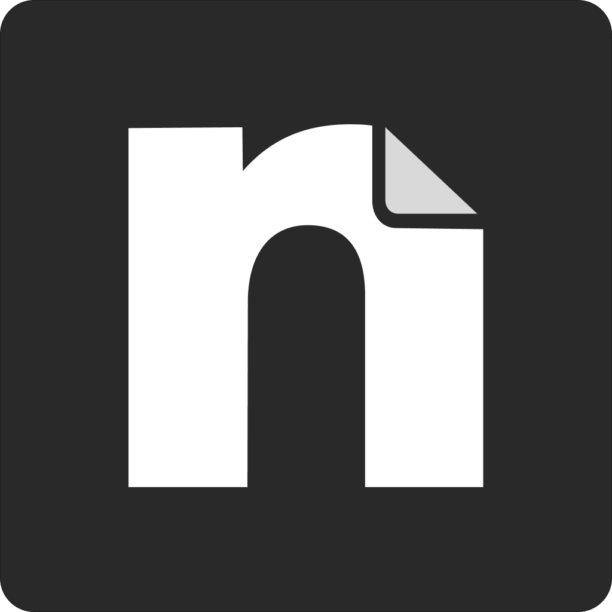

<p align="center">
  
</p>

<h1 align="center">Noteato</h1>

<p align="center">A minimal, block-based note taking app for Apple Silicon Macs. Markdown, folders, search, dictation, sticky notes, reminders, and optional AI — all local, nothing behind an account.</p>

<p align="center">
  <a href="https://github.com/shashankbhat2/noat/actions/workflows/ci.yml"></a>
  <a href="https://github.com/shashankbhat2/noat/releases/latest"></a>
  <a href="LICENSE"></a>
</p>

## Why

Notion is a great tool that happens to also be a browser tab pretending to be an app: a web renderer, a sync engine, a database, a workspace/permissions model, and a note editor, all bundled together, for people who just want to write something down. Noteato is the opposite bet. Blocks and markdown for writing, folders and search for finding things again, dictation for when typing is slower than talking, sticky notes for the stuff that doesn't deserve a whole document, reminders for the stuff you'd otherwise forget, and AI that's entirely optional and bring-your-own-key — nothing routes through a Noteato server. Everything lives on your disk as plain `.md` files, not behind an account.

## Features

### Writing

- **Blocks, not a textarea** — slash menu, headings, to-dos, nesting, tables, etc. ([BlockNote](https://www.blocknotejs.org/))
- **Plain markdown mode** — flip any note to a raw markdown textarea and back, in place.
- **Notion-style block menu** on the drag handle — turn into, duplicate, copy, delete.
- **Note links** — type `@` to mention another note; opens it in a tab, and keeps pointing at the right note even after it's renamed or moved.
- **Per-note full-width toggle**, a **Zen mode** (`⌘.`) that hides the sidebar and tabs for distraction-free writing, four fonts, and six accent colors.

### Organization

- **Nested folders** — create, rename, move, drag-and-drop.
- **Full-text search** (`⌘K`) across every note.
- **Pinned notes**, a **collapsible sidebar** (`⌘\`), inline rename, and undoable delete for both notes and folders.
- **Reminders** — set a one-time date/time reminder on any note from the editor toolbar or the sidebar's right-click menu, with quick presets or a custom picker. Fires a native notification even if the note isn't open; clicking it opens the note. A reminder that passes while the app is closed surfaces as a catch-up notification on the next launch.

### AI (optional, bring your own key)

- **Enhance selected text** — improve, proofread, summarize, or extract key points, streamed in place with Copy/Insert/Replace controls.
- **Ask about this note** — a popup scoped to the current note's content.
- **Agent panel** — a right-side chat with per-note history, @-mentions of other notes as read-only context, creating new notes from chat, full-note edits, and a stop button with real cancellation.
- Anthropic or OpenAI, your key, stored locally. No Noteato backend sits between the app and the provider, and every AI feature is off by default.

### Voice & quick capture

- **Dictation** — press the mic button and talk; streamed live to text via [Deepgram Nova-3](https://deepgram.com/), with an optional AI cleanup pass. Bring your own API key.
- **Sticky notes** — always-on-top, borderless, one click away, visible across every Space.

### Files, tabs, and everything else

- **Markdown on disk** — every note is a plain `.md` file with a small frontmatter header. No database, no export step, no lock-in. Sync it with iCloud/Dropbox/git if you want.
- **Import Markdown** (`⌘O`), and the OS recognizes Noteato as a Markdown editor — double-clicking a `.md` file in Finder opens it directly.
- **Chrome-style tabs** with a real native titlebar (traffic lights included): right-click to pin, close others/to the right/all, plus previous/next tab navigation.
- **Light/dark/system theme**, matched to the actual window chrome, not just the page background.
- Window size and position persist across restarts, including maximized state.
- **Quick-note shortcuts** — `⌘T` new note, `⌘⇧N` new sticky note, `⌘O` import markdown, `⌘K` find in notes, `⌘W` close tab, `⌘\` toggle sidebar, `⌘.` zen mode, `⌘,` settings.

No telemetry, no accounts, no auto-updater phoning home. It's an Electron app, so it isn't the smallest possible binary on disk, but there's nothing running that you didn't ask for.

## Install

Grab the latest `.dmg` from [Releases](https://github.com/shashankbhat2/noat/releases/latest), open it, and drag **Noteato.app** into **Applications**. Apple Silicon (M-series) only — there is no Intel build.

### About the Gatekeeper warning

This app isn't signed with an Apple Developer ID (that costs $99/year, and this is a free side project) or notarized by Apple. On first launch, macOS Gatekeeper will block it — and depending on your macOS version you'll see one of two dialogs:

- **"Noteato can't be opened because it is from an unidentified developer."** — right-click (Control-click) **Noteato.app** in Applications, choose **Open**, then click **Open** again in the dialog. macOS remembers this choice from then on.
- **"Noteato is damaged and should be moved to the Trash."** — this is Gatekeeper being stricter (common on Apple Silicon), and it does **not** offer an "Open anyway" option, so right-click → Open won't help here. Instead, strip the quarantine flag it added on download:

  ```bash
  xattr -cr /Applications/Noteato.app
  ```

  The app isn't actually damaged — this message is just what unsigned + quarantined apps get on newer macOS. Run the command above, then open it normally.

This is the standard tradeoff for unsigned open-source Mac apps — you're trusting the build, not Apple's notarization service. Check the [Releases](https://github.com/shashankbhat2/noat/releases) page for the commit each build was made from if you want to verify it yourself, or build from source below.

### Dictation setup

Dictation needs a [Deepgram](https://deepgram.com/) API key (their free tier covers casual use; Nova-3 streaming is about $0.0056/min beyond that). Open **Settings** (`⌘,`) inside Noteato and paste your key in — it's stored locally in the app's settings file, never sent anywhere but Deepgram.

### AI setup (optional)

The Enhance, Ask-note, and Agent features are off until you add a key. Open **Settings** (`⌘,`) → **AI**, pick Anthropic or OpenAI, and paste in your API key — it's stored locally and used only to call that provider directly. Skip this entirely and Noteato works exactly the same without it.

## Build from source

Requires Node 20+.

```bash
git clone https://github.com/shashankbhat2/noat.git
cd noat
npm install
npm run dev        # run in development
npm run build:mac  # produce a local, unsigned .dmg in dist/
```

## Releasing (maintainers)

1. Bump `version` in `package.json` to `X.Y.Z`.
2. Move the `[Unreleased]` entries in `CHANGELOG.md` under a new `## [X.Y.Z] - YYYY-MM-DD` heading.
3. Commit, then tag and push:
   ```bash
   git tag vX.Y.Z
   git push origin vX.Y.Z
   ```
4. The [release workflow](.github/workflows/release.yml) builds the DMG/ZIP on a macOS runner and attaches them to a GitHub Release named after the tag, with the matching `CHANGELOG.md` section as the release notes.

## License

[MIT](LICENSE)
